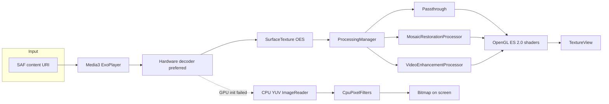

# PixelRestore Player

Local GPU Video Restoration Player.

PixelRestore Player plays **one local video** at a time and can run a real-time image pipeline on the decoded frames. Nothing is uploaded. There is no account, no analytics, and no network permission.

**No AI.** The app does not use TensorFlow Lite, ONNX, neural networks, downloaded models, or any remote inference API. Restoration is traditional filtering on the Android CPU and GPU.

## Features

- Storage Access Framework picker (`video/*`). The player reads the content URI. It does not request broad storage access and it does not copy the file.
- Jetpack Media3 / ExoPlayer playback with hardware decoders preferred and software decoders as a fallback.
- Two mutually exclusive processing modes, plus Off, owned by one `ProcessingManager`:
  - **Mosaic Restoration** — block-boundary smoothing, optional edge smoothing, scale, then sharpen. This is mosaic artifact reduction / visual restoration. It does **not** recover pixels that were permanently discarded by the original encode.
  - **Video Enhancement** — denoise, mild deblock, scale, sharpen, and contrast/saturation. Noise reduction and sharpening can be turned off; those passes are skipped.
- OpenGL ES 2.0 pipeline: hardware decode → `SurfaceTexture` (OES) → fragment shaders → `TextureView`. The GPU path does not read the frame back to the CPU.
- CPU fallback (YUV `ImageReader` plus integer filters, long edge capped at 480px) if EGL or the blit shader cannot start. The status line then says `Processing: CPU`.
- Device capability report (cores, ABI, Android version, RAM, GLES, Vulkan feature, hardware decoder names and sizes when the platform exposes them). Missing probes stay unknown instead of being invented.
- Tier recommendations (low 480p/30, mid 720p/30, high 1080p/30, very high 1080p/60). Auto resolution and Auto frame rate may follow the tier or step down after a sustained overrun. Manual picks are never overwritten.
- Frame-time budget check (about 33.3 ms at 30 FPS, 16.7 ms at 60 FPS). A two-second overrun shows advice such as `Try 720p / 30 FPS for smoother playback`.
- Debug overlay, off by default: resolution, target/actual FPS, dropped frames, decoder HW/SW, processing backend, frame time, pipeline name.
- Dark Material 3 UI. English strings. Works offline.

## Architecture



Packages under `app/src/main/java/com/pixelrestore/player/`:

| Package | Role |
| --- | --- |
| `ui` | Player and settings Compose screens, `PlayerViewModel` |
| `player` | `Media3Player`, `VideoController`, CPU YUV output |
| `processing` | `VideoProcessor`, `ProcessingManager`, profile resolver, CPU filters |
| `gpu` | `EglCore`, `OpenGLRenderer`, `ShaderManager`, `TextureManager` |
| `device` | `DeviceCapabilityDetector`, tiering, frame-time tracker |
| `settings` | DataStore preferences |

Only one processor is initialized at a time. Mosaic and enhancement settings stay stored, but the inactive mode is not applied to frames.

### Mosaic passes

Decoded OES texture → blit into a 2D texture → deblock on an 8px grid (high quality adds a lighter 16px pass) → optional 3×3 edge smooth → scale → unsharp sharpen → screen.

- Scale up uses a Catmull-Rom style bicubic shader for Medium and High. Low uses bilinear.
- Scale down and same-size output use bilinear or a copy. Lanczos is not implemented.
- Quality Low / Medium / High changes strength and which of those passes run. Each pass is a separate shader stage and can be omitted.

### Enhancement passes

Denoise (skipped when Off) → mild deblock → scale when the output size differs → sharpen (skipped when Off) → contrast and saturation.

Enhancement level scales those strengths. Output resolution is Original, 720p, or 1080p when the device can support that size.

### Frame rate

The frame-rate control is a **processing budget**, not a re-encode. The file still plays at its own timeline. The overlay compares frame cost with 1000/target FPS and counts late gaps as dropped frames.

## Build

Requirements:

- JDK 17+ (tested with JDK 21)
- Android SDK platform **37.2** (`platforms;android-37.2`) and build-tools 36.0 / 36.1
- Android Studio that supports Android Gradle Plugin 9.4 (stable channel as of September 2026)

`compileSdk` is **37.2**. The current Jetpack Compose BOM (2026.09) requires compile SDK 37 or newer. `targetSdk` stays **36** (Android 16) so the app does not opt into newer runtime behavior beyond what this first version was checked against. minSdk stays 26.

```bash
export ANDROID_HOME="$HOME/Android/Sdk"   # or your SDK path
echo "sdk.dir=$ANDROID_HOME" > local.properties
./gradlew assembleDebug
./gradlew testDebugUnitTest
```

Android Studio: **File → Open** this directory, let Gradle sync, then **Run** the `app` configuration. The debug APK is `app/build/outputs/apk/debug/app-debug.apk`.

`local.properties` is gitignored.

## Supported Android versions

- **minSdk 26** (Android 8.0). Chosen because current devices that can sustain GPU video effects are well above this floor, adaptive icons and scoped-storage-era URI grants are available, and it avoids legacy external-storage permissions. Media3 still runs on older releases; this app does not.
- **compileSdk 37.2**, **targetSdk 36**.

## Hardware acceleration

- ExoPlayer's default codec list is sorted so `hardwareAccelerated` decoders come first. `setEnableDecoderFallback(true)` allows a software decoder if hardware fails.
- The debug overlay reports the decoder name from `AnalyticsListener.onVideoDecoderInitialized` and labels `OMX.google.*`, `c2.android.*`, and FFmpeg names as software.
- Video is decoded to a `SurfaceTexture`. Shaders sample that external texture and write a `TextureView`, so the GPU path does not do a GPU→CPU→GPU copy.
- Vulkan is **detected** (`PackageManager.FEATURE_VULKAN_HARDWARE_VERSION`; API 36 no longer exposes `FEATURE_VULKAN`) for the capability report. Rendering in this version is OpenGL ES 2.0 only.
- If EGL setup or the blit shader fails, playback switches to the CPU path and the status line shows `Processing: CPU`.

## Privacy

All playback and processing happen on this device. PixelRestore Player does not upload videos, does not use cloud processing, and does not include analytics or tracking. The manifest does not declare `INTERNET`. Backup of app data is disabled.

## Known limitations

- Mosaic mode reduces visible block edges. It cannot reconstruct detail that the encoder threw away.
- Deblock assumes an 8-pixel grid (plus a lighter 16-pixel pass at high quality). That matches many AVC macroblock edges and only approximates HEVC/AV1 block structure.
- Upscale is bicubic (Catmull-Rom style) or bilinear. It is not Lanczos and it is not a super-resolution model.
- The frame-rate setting does not transcode the file.
- CPU fallback converts YUV in software and caps the long edge at 480px. It is slower and softer than the GPU path. Bicubic math is not repeated on the CPU; scaling there is the decoder/surface size plus point sampling in the converter.
- Single-video playback only. There is no export, playlist, or picture-in-picture in this version.
- A shader that fails to compile is skipped. The UI shows `Not yet implemented on this GPU: …` for that stage instead of pretending it ran.
- Debug overlay defaults to off. Auto Optimization defaults to on. Processing mode defaults to Off until you choose a mode.

## Roadmap

- Optional export of the processed stream on device (still no cloud).
- Stronger deblock that follows codec block sizes when the bitstream exposes them.
- A true Lanczos scale pass behind the same `FilterPass` switch.
- GLES 3.0 path where `GL_MAX_TEXTURE_SIZE` and extensions make larger kernels cheaper.
- Vulkan only if it can replace the GLES path without a second copy.

## License

Apache-2.0. See [LICENSE](LICENSE). Direct dependencies (Media3, AndroidX, Compose, Kotlin, DataStore, Coroutines) are Apache-2.0 as well. No dependency in this version forces a different license.

## Contributing

See [CONTRIBUTING.md](CONTRIBUTING.md).
