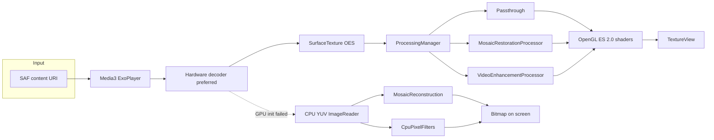

# PixelRestore Player

Local GPU Video Restoration Player.

PixelRestore Player plays **one local video** at a time and can run a real-time image pipeline on the decoded frames. Nothing is uploaded. There is no account, no analytics, and no network permission.

**No AI.** The app does not use TensorFlow Lite, ONNX, neural networks, downloaded models, or any remote inference API. Restoration is traditional filtering on the Android CPU and GPU.

## Features

- Storage Access Framework picker (`video/*`). The player reads the content URI. It does not request broad storage access and it does not copy the file.
- Jetpack Media3 / ExoPlayer playback with hardware decoders preferred and software decoders as a fallback.
- Two mutually exclusive processing modes, plus Off, owned by one `ProcessingManager`:
  - **Mosaic Reconstruction** — detects the pixelation lattice, then estimates pixels from neighboring block colors (bilinear, edge-directed, Catmull-Rom) plus block-matching across frames. This is mosaic artifact removal. It does **not** recover the original pixels.
  - **Video Enhancement** — denoise, mild deblock, scale, sharpen, and contrast/saturation. Noise reduction and sharpening can be turned off; those passes are skipped.
- OpenGL ES 2.0 pipeline: hardware decode → `SurfaceTexture` (OES) → fragment shaders → `TextureView`. Reconstruction stays on the GPU. The mosaic detector reads a 192×108 center crop about twice a second so it can estimate block size and phase.
- CPU fallback (YUV `ImageReader` plus integer filters, long edge capped at 480px) if EGL or the blit shader cannot start. The status line then says `Processing: CPU`.
- Device capability report (cores, ABI, Android version, RAM, GLES, Vulkan feature, hardware decoder names and sizes when the platform exposes them). Missing probes stay unknown instead of being invented.
- Tier recommendations (low 480p/30, mid 720p/30, high 1080p/30, very high 1080p/60). Auto resolution and Auto frame rate may follow the tier or step down after a sustained overrun. Manual picks are never overwritten.
- Frame-time budget check (about 33.3 ms at 30 FPS, 16.7 ms at 60 FPS). A two-second overrun shows advice such as `Try 720p / 30 FPS for smoother playback`.
- Debug overlay, off by default: resolution, target/actual FPS, dropped frames, decoder HW/SW, decoder offset, GPU time, frame time, pipeline name.
- Mosaic debug mode: Original, Detected Mosaic Grid, Reconstructed, or Final Output, with block size and grid offset. An **Original / Processed** button toggles the unprocessed frame instantly.
- Dark Material 3 UI. English strings. Works offline.

## Architecture



Packages under `app/src/main/java/com/pixelrestore/player/`:

| Package | Role |
| --- | --- |
| `ui` | Player and settings Compose screens, `PlayerViewModel` |
| `player` | `Media3Player`, `VideoController`, CPU YUV output |
| `processing` | `VideoProcessor`, `ProcessingManager`, profile resolver, CPU filters |
| `gpu` | `EglCore`, `OpenGLRenderer`, `ShaderManager`, `TextureManager` |
| `device` | `DeviceCapabilityDetector`, tiering, frame-time tracker |
| `settings` | DataStore preferences |

Only one processor is initialized at a time. Mosaic and enhancement settings stay stored, but the inactive mode is not applied to frames.

### Mosaic reconstruction

Pipeline: decoder frame → mosaic detector → grid model → spatial reconstruction → edge-aware interpolation → temporal block match → deblock → sharpen → display.

The old fixed-grid deblock / blur / sharpen chain is not the mosaic path anymore. Video Enhancement still uses denoise, mild deblock, scale, sharpen, and contrast.

1. **MosaicDetector** scores candidate square sizes (2 through 32, including sizes that are not powers of two). For each size it searches the horizontal and vertical phase separately. A real mosaic is flat inside a block and discontinuous on the border, so the score is the border gradient divided by the interior gradient. Both axes must agree, which rejects a harmonic such as 32 when the real cell is 8. Auto samples a 192×108 center crop. If that crop has no lattice, the status line says `grid not detected` and the picture stays original until you pick a size. Manual sizes are Auto, 2×2, 4×4, 8×8, 16×16, and 32×32. Manual still estimates the phase.
2. **Spatial reconstruction** treats each block center as one low-resolution sample. Low quality is bilinear on that lattice, then a light unsharp mask. It does not blur the mosaic squares.
3. **Edge-aware step.** Medium and High keep a hard step only when one neighbor jumps and the other side is flat (a real edge). A smooth ramp stays bilinear, so object boundaries, text, and high-contrast structure are not smeared when the edge sits on the grid. High mixes a Catmull-Rom sample of the same lattice in smooth areas and keeps the directional sample where the step is strong.
4. **Temporal.** Medium and High block-match a 3×3 neighborhood of block colors against the previous frame (no neural optical flow). Where the match is close, the current estimate is blended with the previous reconstruction shifted by that motion. The CPU reference searches ±1 block at Medium and ±2 at High. The GPU shader searches ±1 block so 720p stays practical.
5. **Deblock and sharpen.** Weak seams (not strong edges) are pulled toward the bilinear sample. Sharpen runs after reconstruction. High sharpen is stronger where the local gradient is real and weaker on the lattice line.

Quality, and where it runs:

| Quality | Algorithm | Realtime |
| --- | --- | --- |
| Low | Lattice bilinear + sharpen | Fast. Prefer this if Medium misses the frame budget. |
| Medium | Edge-aware + deblock + temporal match + sharpen | Target for 720p / 30 FPS on a mid-range phone. GPU. |
| High | Medium, plus Catmull-Rom in smooth areas and a wider CPU motion search | Heavier. Auto Optimization can still step Auto resolution or Auto frame rate down. It never overwrites a manual pick. |

GPU path: OES blit, then the spatial fragment shader, then (Medium/High) a temporal fragment shader that also sharpens. Vulkan is still only reported in the capability screen; drawing is OpenGL ES 2.0. The CPU fallback runs the same `MosaicReconstruction` code at the existing 480px long-edge cap.

Debug: Mosaic Debug Mode selects Original, Detected Mosaic Grid, Reconstructed (spatial only), or Final Output. The player button **Original / Processed** forces the original frame without changing the mode.

### Synthetic check

`MosaicReconstructionTest` builds an image, replaces each block with its average, reconstructs, and compares with a blur-then-sharpen baseline. On a 96×96 ramp pixelated at 8×8, Medium reconstruction measured:

| | Mosaic | Blur + sharpen | Reconstruction |
| --- | --- | --- | --- |
| Block-boundary strength | 5.62 | 1.06 | 0.085 |
| PSNR vs source (dB) | 36.87 | 38.41 | 41.80 |
| SSIM (luma) | 0.973 | 0.981 | 0.991 |

An aligned black/white edge stays a step after Medium (transition width 0) and becomes a 7px ramp at Low bilinear. These numbers are estimates on a synthetic lattice, not a claim that a censored face comes back.

### Enhancement passes

Denoise (skipped when Off) → mild deblock → scale when the output size differs → sharpen (skipped when Off) → contrast and saturation.

Enhancement level scales those strengths. Output resolution is Original, 720p, or 1080p when the device can support that size.

### Frame rate

The frame-rate control is a **processing budget**, not a re-encode. The file still plays at its own timeline. The overlay compares frame cost with 1000/target FPS and counts late gaps as dropped frames.

## Build

Requirements:

- JDK 17+ (tested with JDK 21)
- Android SDK platform **37.2** (`platforms;android-37.2`) and build-tools 36.0 / 36.1
- Android Studio that supports Android Gradle Plugin 9.4 (stable channel as of September 2026)

`compileSdk` is **37.2**. The current Jetpack Compose BOM (2026.09) requires compile SDK 37 or newer. `targetSdk` stays **36** (Android 16) so the app does not opt into newer runtime behavior beyond what this first version was checked against. minSdk stays 26.

```bash
export ANDROID_HOME="$HOME/Android/Sdk"   # or your SDK path
echo "sdk.dir=$ANDROID_HOME" > local.properties
./gradlew assembleDebug
./gradlew testDebugUnitTest
```

Android Studio: **File → Open** this directory, let Gradle sync, then **Run** the `app` configuration. The debug APK is `app/build/outputs/apk/debug/app-debug.apk`.

`local.properties` is gitignored.

## GitHub Actions APK builds

Workflow: [`.github/workflows/build-apk.yml`](.github/workflows/build-apk.yml).

It runs on `ubuntu-latest` with Temurin JDK 17 and Android command-line tools `16111833`. The job installs `platforms;android-37.2` and `build-tools;36.0.0`, then runs `./gradlew assembleDebug assembleRelease`.

This is a small custom workflow (checkout, JDK, `android-actions/setup-android`, Gradle, upload). The marketplace action [Build and Publish Release APK](https://github.com/marketplace/actions/build-and-publish-release-apk-from-your-android-project) is not used: it tracks `@master`, uses JDK 11, asks for an extra PAT, and does not install compile SDK 37.2 or support manual dispatch.

### What you get

| Build | File | Signature |
| --- | --- | --- |
| debug | `PixelRestore-Player-<ref>-debug.apk` | Signed with the runner's ephemeral debug keystore. It installs. The certificate is different on every run. |
| release | `PixelRestore-Player-<ref>-release-unsigned.apk` | **Unsigned.** There is no release keystore and no signing secret in this repo. Sign it yourself before shipping a production build. |

Both files are uploaded as one Actions artifact named `PixelRestore-Player-<ref>` (kept 14 days). `<ref>` is the tag (`v1.0.0`) or, for a manual run, the branch name.

A **tag push** also creates (or updates) a GitHub Release for that tag and attaches both APKs. The workflow uses the built-in `GITHUB_TOKEN` with `contents: write`. It does not read a personal access token or a keystore secret. A manual run uploads artifacts only and does not publish a Release.

### Create a tag

From a commit you want to ship:

```bash
git tag v1.0.0
git push origin v1.0.0
```

Only tags matching `v*` start the workflow (`v1.0.0`, `v1.0.0-rc1`). The Release page for that tag then lists both APKs under Assets. The same files are on the Actions run.

### Download the artifact

1. Open the **Actions** tab and the **Build APK** workflow.
2. Open the run for your tag or manual dispatch.
3. Download **PixelRestore-Player-&lt;ref&gt;** from the Artifacts section.

On a tag run you can also download the APKs from the Release page (**Releases** → the tag → Assets).

### Run it by hand

**Actions → Build APK → Run workflow**, then pick the branch. That is `workflow_dispatch`. It builds the same two APKs and uploads the artifact. It does not create a Release.

## Supported Android versions

- **minSdk 26** (Android 8.0). Chosen because current devices that can sustain GPU video effects are well above this floor, adaptive icons and scoped-storage-era URI grants are available, and it avoids legacy external-storage permissions. Media3 still runs on older releases; this app does not.
- **compileSdk 37.2**, **targetSdk 36**.

## Hardware acceleration

- ExoPlayer's default codec list is sorted so `hardwareAccelerated` decoders come first. `setEnableDecoderFallback(true)` allows a software decoder if hardware fails.
- The debug overlay reports the decoder name from `AnalyticsListener.onVideoDecoderInitialized` and labels `OMX.google.*`, `c2.android.*`, and FFmpeg names as software.
- Video is decoded to a `SurfaceTexture`. Shaders sample that external texture and write a `TextureView`, so the GPU path does not do a GPU→CPU→GPU copy.
- Vulkan is **detected** (`PackageManager.FEATURE_VULKAN_HARDWARE_VERSION`; API 36 no longer exposes `FEATURE_VULKAN`) for the capability report. Rendering in this version is OpenGL ES 2.0 only.
- If EGL setup or the blit shader fails, playback switches to the CPU path and the status line shows `Processing: CPU`.

## Privacy

All playback and processing happen on this device. PixelRestore Player does not upload videos, does not use cloud processing, and does not include analytics or tracking. The manifest does not declare `INTERNET`. Backup of app data is disabled.

## Known limitations

- Mosaic Reconstruction estimates a higher-resolution field from block colors and nearby frames. It cannot restore detail that the mosaic average discarded, and it does not undo a lossy encode. Auto-detect looks at the center 192×108; a mosaic only in a corner needs a manual block size.
- Video Enhancement deblock still uses an 8-pixel coding grid. That matches many AVC macroblock edges and only approximates HEVC/AV1 block structure. It is not the mosaic lattice.
- Upscale is bicubic (Catmull-Rom style) or bilinear. It is not Lanczos and it is not a super-resolution model.
- The frame-rate setting does not transcode the file.
- CPU fallback converts YUV in software and caps the long edge at 480px. It is slower and softer than the GPU path. Bicubic math is not repeated on the CPU; scaling there is the decoder/surface size plus point sampling in the converter.
- Single-video playback only. There is no export, playlist, or picture-in-picture in this version.
- A shader that fails to compile is skipped. The UI shows `Not yet implemented on this GPU: …` for that stage instead of pretending it ran.
- Debug overlay defaults to off. Auto Optimization defaults to on. Processing mode defaults to Off until you choose a mode.

## Roadmap

- Optional export of the processed stream on device (still no cloud).
- Stronger deblock that follows codec block sizes when the bitstream exposes them.
- A true Lanczos scale pass behind the same `FilterPass` switch.
- GLES 3.0 path where `GL_MAX_TEXTURE_SIZE` and extensions make larger kernels cheaper.
- Vulkan only if it can replace the GLES path without a second copy.

## License

Apache-2.0. See [LICENSE](LICENSE). Direct dependencies (Media3, AndroidX, Compose, Kotlin, DataStore, Coroutines) are Apache-2.0 as well. No dependency in this version forces a different license.

## Contributing

See [CONTRIBUTING.md](CONTRIBUTING.md).
